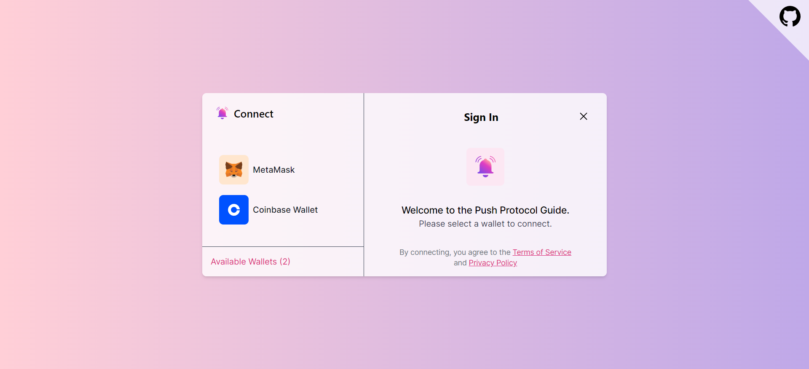
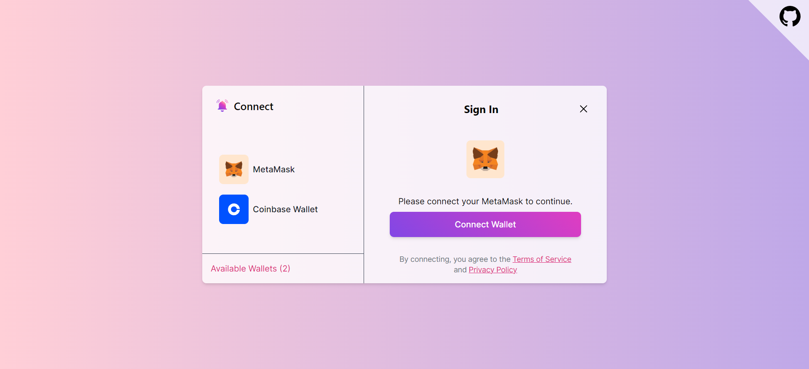
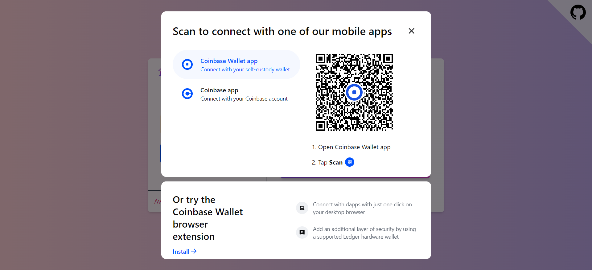
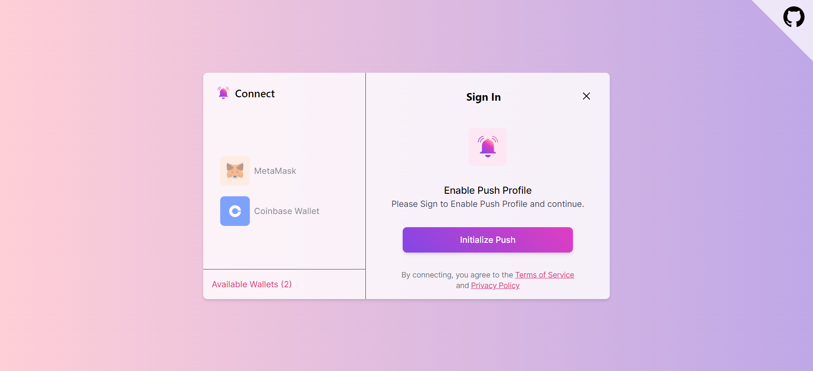
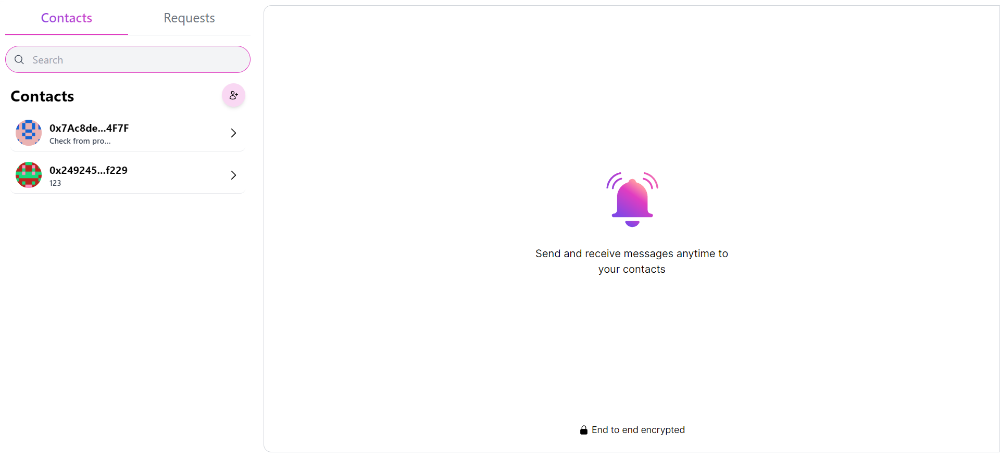

# Push Chat Example

Push Chat is a simple yet powerful chat application built using Push Protocol. It leverages Push Protocol's efficient messaging system to enable real-time communication between users.

## Prerequisites

Before running the Push Chat project, ensure you have the following prerequisites installed:

1. **Node.js and npm**:
   - [Node.js](https://nodejs.org/): Download and install Node.js from the official website.
   - npm: npm is included with Node.js, so once you install Node.js, npm will be installed automatically.

Once Node.js and npm are installed, navigate to the root directory of the Push Chat project and run the following command to install dependencies:

```bash
npm install
```

## Getting Started

First, run the development server:

```bash
npm run dev
# or
yarn dev
# or
pnpm dev
# or
bun dev
```

Open [http://localhost:3000](http://localhost:3000) with your browser to see the result.

## Onboarding Process

1. **Launch the Application**: Once the Push Chat is running, open your web browser and navigate to the provided URL.

2. **Onboarding Page**: Upon accessing the application, you'll be directed to the Onboarding Page, where you'll initiate the setup process.

   

3. **Connect with Metamask or Coinbase Wallet**:

   - **Metamask**: If you have Metamask installed, click on the "Connect with Metamask" button. A popup will appear prompting you to connect your Metamask wallet to the Push Chat. Follow the instructions to connect your wallet.

   

   - **Coinbase Wallet**: Alternatively, if you prefer to use Coinbase Wallet, click on the "Connect with Coinbase Wallet" button. You'll be redirected to the Coinbase Wallet login page. Enter your credentials to connect your wallet.

   

4. **Initialize Push Protocol**:

   - After connecting your wallet, the Push Protocol initialization process will begin automatically. A confirmation message will be displayed once Push Protocol is successfully initialized.

   

5. **Confirmation and Start Chatting**: Once both your wallet is connected and Push Protocol is initialized, you'll receive a confirmation message. You're now ready to start chatting with other users in Push Chat!

   

## Project Folder Structure

### `public/`

- **`images/`**: Contains images used in the application, such as the logo, background images, and app icon.

### `screenshots/`

Stores screenshots of the web application for documentation or promotional purposes.

### `src/`

- **`app/`**: Contains the main application file (`App.tsx`) and routing configuration (`layout.tsx`).
- **`components/`**: Houses reusable UI components used throughout the application.
  - **`layout/`**: Components related to the layout structure of the application, such as header, footer, and overall layout.
  - **`modals/`**: Component representing modals used for various interactions, like adding new contacts.
  - **`onBoard/`**: Components specific to the onboarding process, guiding users through initial setup steps.
  - **`ui/`**: UI components such as buttons, inputs, and modal components.
- **`hooks/`**: Custom React hooks used across the application, promoting code reuse and organization.
- **`provider/`**: Context providers responsible for managing application-wide state with Wagmi and Redux.
- **`redux/`**: Contains Redux-related files, including slices defining reducers and the Redux store configuration.
  - **`slices/`**: Redux slice files defining actions, reducers, and initial state for specific features (e.g., user, chat).
- **`types/`**: TypeScript type definitions used throughout the application, enhancing type safety and code readability.
- **`wagmi/`**: Configuration files and setup for integrating Wagmi, a provider for Web3 authentication and blockchain integration.

### `tailwind.config.js`

- Configuration file for Tailwind CSS, allowing customization and optimization of the utility-first CSS framework.

## Development Process Documentation

### Introduction

Push Chat's development journey involved leveraging Push Protocol for a robust real-time chat application. This document highlights key learnings and challenges encountered, aiming to offer insights for the community.

### Key Learnings

1. **Understanding Push Protocol**: Thoroughly grasping Push Protocol's features and functionalities laid the foundation for seamless integration into our application.

2. **Integration with Next.js and Tailwind CSS**: Integrating Push Protocol with Next.js and Tailwind CSS required efficient component structuring and performance optimization.

3. **User Authentication and Wallet Integration**: Implementing secure user authentication and integrating cryptocurrency wallets demanded careful planning and attention to security.

4. **Real-Time Communication Challenges**: Managing message delivery, and data consistency across multiple clients were effectively addressed using Push Protocol features.

### Challenges Faced

1. **Complexity of Push Protocol**: Integrating Push Protocol into our application presented authentication, routing, and error handling challenges that required thorough debugging.

2. **Performance Optimization**: Optimizing performance, reducing network overhead, and minimizing resource utilization demanded continuous monitoring and optimization.

## Contributing

We welcome contributions from the community! If you'd like to contribute to Push Chat, please follow these guidelines:

1. Fork the repository and create a new branch for your feature or bug fix.
2. Make your changes, ensuring to follow the project's coding style and conventions.
3. Write tests to cover your changes, if applicable.
4. Commit your changes and push them to your fork.
5. Submit a pull request to the main repository, explaining the purpose and details of your changes.

We'll review your pull request as soon as possible. Thank you for contributing to Push Chat!

## License

This project is licensed under the [MIT License](LICENSE). You are free to use, modify, and distribute this project under the terms of the MIT License. See the [LICENSE](LICENSE) file for details.

## Acknowledgements

We would like to thank the following individuals and projects for their contributions to Push Chat:

<table>
  <tr>
    <td align="center"><a href="https://github.com/Gautam25Raj"><br /><sub><b>Gautam Raj</b></sub></a></td>
    <td align="center"><a href="https://github.com/AnoyRC"><br /><sub><b>Anoy Roy Chowdhury</b></sub></a></td>
  </tr>
</table>

- [Push Protocol](https://push.org): For providing a powerful messaging solution.
- [Metamask](https://metamask.io): For their browser extension enabling Ethereum wallet connectivity.
- [Coinbase Wallet](https://www.coinbase.com/en-gb): For their cryptocurrency wallet and integration support.

Your support and contributions are greatly appreciated!

## Resources

Here are some additional resources you may find helpful:

- [Push Chat Documentation](https://push.org/docs/chat): Comprehensive documentation for using and extending Push Chat.
- [Push Protocol SDK Documentation](https://push.org/docs): Documentation for integrating Push Protocol SDK into your applications.
- [Tailwind CSS Documentation](https://tailwindcss.com): Official documentation for Tailwind CSS, used for styling Push Chat.
- [Next.js Documentation](https://nextjs.org/docs): Official documentation for Next js App routing.

## Conclusion

Despite challenges, Push Chat successfully showcases Push Protocol's capabilities. This document serves as a concise resource offering insights into real-time communication development using Push Protocol.

For detailed technical information and code samples, refer to the project's [GitHub repository](https://github.com/Push-Example-Repos/push-chat).
